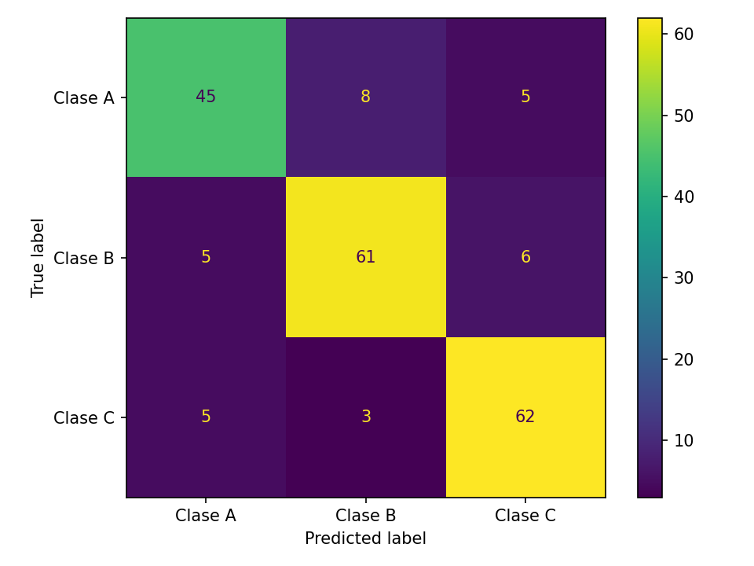
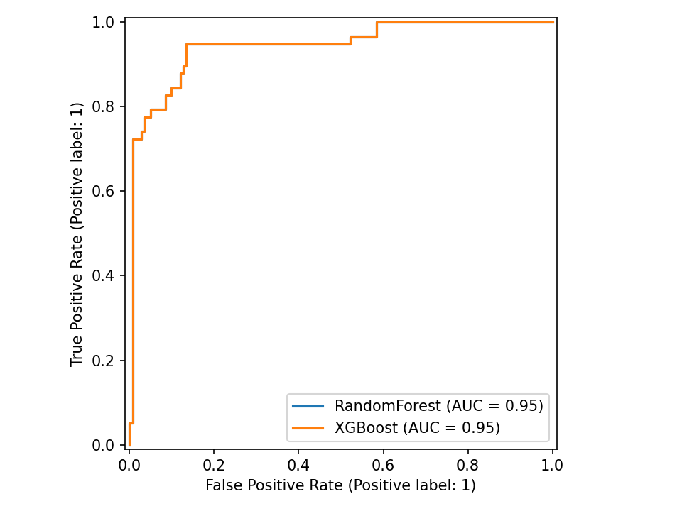
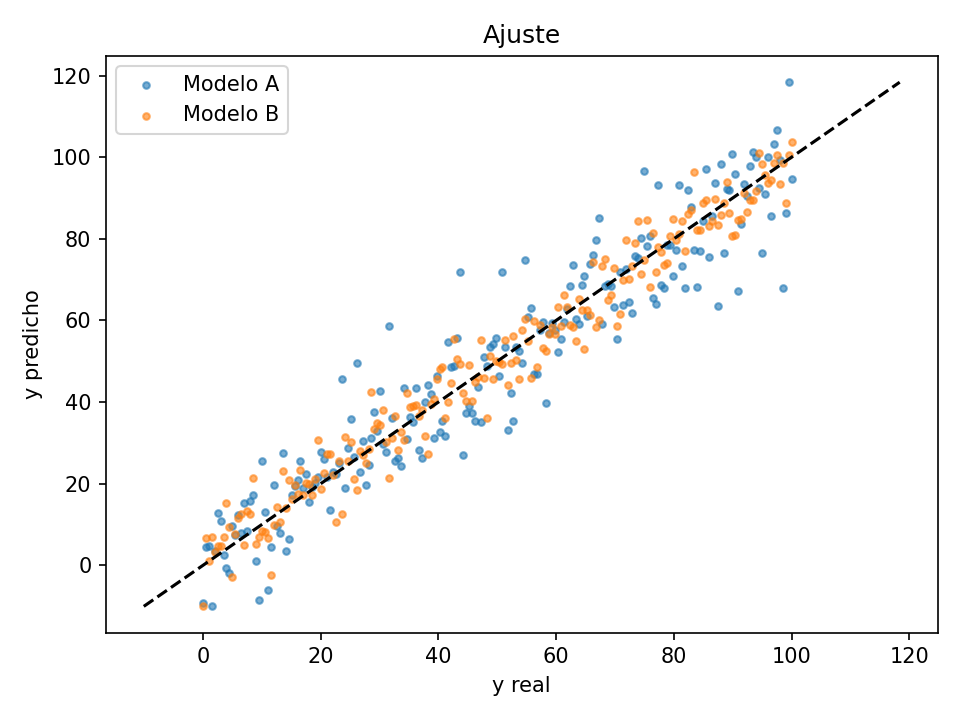

<p align="right">
  <a href="https://github.com/Ricardouchub/evalcards/blob/master/README-english.md">
    README English
  </a>
</p>

# evalcards

[](https://badge.fury.io/py/evalcards)
[](https://pypi.org/project/evalcards/)
[](https://github.com/Ricardouchub/evalcards/actions/workflows/ci.yml)
[](https://github.com/Ricardouchub/evalcards/actions/workflows/release.yml)

<p align="center">
  
  
  
</p>

**[evalcards](https://pypi.org/project/evalcards/)** es una librería para Python que genera reportes de evaluación para **modelos supervisados** en **Markdown**, con **métricas** y **gráficos** listos para usar en informes. Soporta:
- **Clasificación**: binaria y **multiclase (OvR)** con métricas como `accuracy`, `balanced_accuracy`, `mcc`, `log_loss` (si hay probabilidades), `roc_auc`/`pr_auc`, además de curvas **ROC/PR** por clase.
- **Regresión**: `MAE`, `MSE`, `RMSE`, `R²`, `MedAE`, `MAPE`, `RMSLE`.
- **Forecasting** (series de tiempo): `MAE`, `MSE`, `RMSE`, `MedAE`, `MAPE`, `RMSLE`, **sMAPE (%)** y **MASE**.
- **Clasificación multi-label**: matriz de confusión y curvas **ROC/PR por etiqueta** si se pasan probabilidades.
- **Export JSON** métricas y rutas de imágenes para integración en pipelines (nuevo en v0.2.11).

## Instalación
-----------
```bash
pip install evalcards
```

## Uso rápido (Python)
-------------------
```python
from evalcards import make_report

# y_true: etiquetas/valores reales
# y_pred: etiquetas/valores predichos
# y_proba (opcional):
#   - binaria: vector 1D con prob. de la clase positiva
#   - multiclase: matriz (n_samples, n_classes) con prob. por clase
#   - multi-label: matriz (n_samples, n_labels) con prob. por etiqueta

path = make_report(
    y_true, y_pred,
    y_proba=proba,                 # opcional
    path="reporte.md",             # nombre del archivo Markdown
    title="Mi modelo"              # título del reporte
)
print(path)  # ruta del reporte generado
```

## Qué evalúa
------------------
- **Clasificación (binaria/multiclase/multi-label)**
  Métricas: `accuracy`, `precision/recall/F1` (macro/weighted), `balanced_accuracy`, `mcc`, `log_loss` (si hay probabilidades).
  AUC / AUPRC: `roc_auc` y `pr_auc` (binaria), `roc_auc_ovr_macro` y `pr_auc_macro` (multiclase), `roc_auc_macro` (multi-label).
  Gráficos: **matriz de confusión**, **ROC** y **PR** (por clase en multiclase, por etiqueta en multi-label).

- **Regresión**
  Métricas: `MAE`, `MSE`, `RMSE`, `R²`, `MedAE`, `MAPE`, `RMSLE`.
  Gráficos: **Ajuste (y vs ŷ)** y **Residuales**.

- **Forecasting**
  Métricas: `MAE`, `MSE`, `RMSE`, `MedAE`, `MAPE`, `RMSLE`, **sMAPE (%)**, **MASE**.
  Parámetros extra: `season` (p.ej. 12) e `insample` (serie de entrenamiento para MASE).
  Gráficos: **Ajuste** y **Residuales**.

## Ejemplos 
---------------
**1) Clasificación binaria (scikit-learn)**
```python
from sklearn.datasets import make_classification
from sklearn.linear_model import LogisticRegression
from sklearn.model_selection import train_test_split
from evalcards import make_report

X, y = make_classification(n_samples=600, n_features=10, random_state=0)
X_tr, X_te, y_tr, y_te = train_test_split(X, y, test_size=0.3, random_state=0)

clf = LogisticRegression(max_iter=1000).fit(X_tr, y_tr)
y_pred = clf.predict(X_te)
proba = clf.predict_proba(X_te)[:, 1]

make_report(y_te, y_pred, y_proba=proba, path="rep_bin.md", title="Clasificación binaria")
```

**2) Multiclase (OvR)**
```python
from sklearn.datasets import load_iris
from sklearn.ensemble import RandomForestClassifier
@@ -107,51 +107,51 @@ X, y = make_multilabel_classification(n_samples=300, n_features=12, n_classes=4,
clf = MultiOutputClassifier(LogisticRegression(max_iter=1000)).fit(X, y)
y_pred = clf.predict(X)
# Probabilidad por etiqueta (matriz n_samples x n_labels)
y_proba = np.stack([m.predict_proba(X)[:,1] for m in clf.estimators_], axis=1)

make_report(y, y_pred, y_proba=y_proba, path="rep_multilabel.md", title="Multi-label Example", lang="en",
            labels=[f"Tag_{i}" for i in range(y.shape[1])])
```

**4) Regresión**
```python
from sklearn.datasets import make_regression
from sklearn.ensemble import RandomForestRegressor
from sklearn.model_selection import train_test_split
from evalcards import make_report

X, y = make_regression(n_samples=600, n_features=8, noise=10, random_state=0)
X_tr, X_te, y_tr, y_te = train_test_split(X, y, test_size=0.3, random_state=0)

reg = RandomForestRegressor(random_state=0).fit(X_tr, y_tr)
y_pred = reg.predict(X_te)

make_report(y_te, y_pred, path="rep_reg.md", title="Regresión")
```

**5) Forecasting (sMAPE/MASE + métricas extra)**
```python
import numpy as np
from evalcards import make_report

rng = np.random.default_rng(0)
t = np.arange(360)
y = 10 + 0.05*t + 5*np.sin(2*np.pi*t/12) + rng.normal(0,1,360)

y_train, y_test = y[:300], y[300:]
y_hat = y_test + rng.normal(0, 1.2, y_test.size)  # predicción de ejemplo

make_report(
    y_test, y_hat,
    task="forecast", season=12, insample=y_train,
    path="rep_forecast.md", title="Forecast"
)
```

**6) Comparación Multi-Modelo (Nuevo en v0.3.0)**
```python
from evalcards import make_report
# Puedes pasar un diccionario con los nombres de tus modelos y sus predicciones
y_preds = {"Random Forest": y_pred_rf, "XGBoost": y_pred_xgb}
y_probas = {"Random Forest": proba_rf, "XGBoost": proba_xgb}

# Generará curvas conjuntas y tablas comparativas en el mismo reporte HTML/Markdown
make_report(y_te, y_preds, y_proba=y_probas, path="rep_multi.html", fmt="html", title="Comparativa")
```

**7) Análisis de Equidad (Fairness & Bias)**
```python
# Mide el rendimiento por subgrupo demográfico, de cliente, etc.
grupos = ["Joven", "Adulto", "Adulto", "Joven", ...] 
make_report(y_te, y_pred, sensitive_features=grupos, title="Reporte de Equidad")
```

**8) Tareas de Ranking (NDCG)**
```python
# Para sistemas de búsqueda o recomendación
make_report(y_te, y_pred, task="ranking", query_id=user_ids, title="Resultados de Búsqueda")
```

## Configuración y Formatos
-------------------
- **.evalcards.toml**: Si creas un archivo `.evalcards.toml` en tu directorio, `evalcards` usará sus parámetros por defecto (útil para la CLI).
  ```toml
  [evalcards]
  outdir = "reportes_diarios"
  lang = "es"
  format = "html"
  ```
- **Formatos Rápidos (CLI)**: Puedes usar archivos `.parquet` y `.feather` directamente en los argumentos `--y_true`, `--y_pred` y `--proba` para cargar millones de registros rápidamente.

## Salidas y PATH
-------------------
- Un archivo **Markdown** con las métricas y referencias a imágenes generadas.
- Imágenes **PNG** (según el tipo de tarea):
  - **Clasificación binaria**:  
    - `confusion.png` (matriz de confusión global)  
    - `roc.png` (curva ROC)  
    - `pr.png` (curva Precision-Recall)
  - **Clasificación multiclase (OvR)**:  
    - `confusion.png` (matriz de confusión global)  
    - `roc_class_<clase>.png` (curva ROC para cada clase, One-vs-Rest)  
    - `pr_class_<clase>.png` (curva PR para cada clase)
  - **Clasificación multi-label**:  
    - `confusion_<etiqueta>.png` (matriz de confusión para cada etiqueta)  
    - `roc_label_<etiqueta>.png` (curva ROC para cada etiqueta, si se pasan probabilidades)  
    - `pr_label_<etiqueta>.png` (curva PR para cada etiqueta, si se pasan probabilidades)
  - **Regresión / Forecasting**:  
    - `fit.png` (dispersión y vs ŷ, ajuste del modelo)  
    - `resid.png` (gráfico de residuales)

- **Ubicación de archivos**:
  - Por defecto, los archivos se guardan en la carpeta `./evalcards_reports/` si `path` no incluye ruta.
  - Puedes cambiar la carpeta con el argumento `out_dir` o usando una ruta en `path`.

- **Export JSON (opcional)**:  
  Si usas el parámetro `export_json`, también se genera un archivo `.json` con las métricas y los nombres/rutas de los PNG generados.

- **Ejemplo de nombres multi-label**:  
  Si usas `labels=["A","B","C"]`, los archivos serán:  
  - `confusion_A.png`, `roc_label_A.png`, `pr_label_A.png`  
  - `confusion_B.png`, `roc_label_B.png`, `pr_label_B.png`  
  - etc.

- **JSON (opcional)**: contiene `metrics`, `charts` y `markdown`.

## Entradas esperadas (formas comunes)
-----------------------------------
- **Clasificación**
  - `y_true`: enteros 0..K-1 (o etiquetas string).
  - `y_pred`: del mismo tipo/espacio de clases que `y_true`.
  - `y_proba` (opcional):
    - **Binaria**: vector 1D con prob. de la clase positiva.
    - **Multiclase**: matriz `(n_samples, n_classes)` con una columna por clase (mismo orden que tu modelo).
    - **Multi-label**: matriz `(n_samples, n_labels)` con una columna por etiqueta (proba de pertenecer).
- **Regresión / Forecast**
  - `y_true`, `y_pred`: arrays 1D de floats.
  - `insample` (forecast): serie de entrenamiento para MASE; `season` según la estacionalidad (ej. 12 mensual/anual).

## Compatibilidad de modelos
------------------------
Funciona con **cualquier modelo** que produzca `predict` (y opcionalmente `predict_proba`):
- scikit-learn, XGBoost/LightGBM/CatBoost, statsmodels, Prophet/NeuralProphet, Keras/PyTorch.
- Multiclase: `y_proba` como matriz (una columna por clase) y  `labels` para nombres.


## Roadmap
------------------------
### v0.3 — Salida y métricas clave
- [x] Reporte HTML autocontenido (`format="md|html|both"`)
- [x] Export JSON** de métricas/paths (`--export-json`)
- [x] Métricas nuevas (clasificación): AUPRC, Balanced Accuracy, MCC, Log Loss, Brier Score
- [x] Métricas nuevas (regresión): MAPE, MedAE, RMSLE

### v0.4 — Multiclase y umbrales
- [x] Análisis de umbral (curvas precisión–recobrado–F1 vs umbral)
- [ ] ROC/PR micro & macro (multiclase) + `roc_auc_macro`, `average_precision_macro`
- [ ] Matriz de confusión normalizada (global y por clase)

### v0.5 — Probabilidades y comparación
- [x] Calibración: Brier score + curva de confiabilidad (Reliability Curve)
- [x] Comparación multi-modelo en un único reporte (pasa dict a y_pred/y_proba)
- [x] Gráficos interactivos HTML con Plotly
- [x] Análisis de Sesgo (Fairness & Bias) con `sensitive_features`
- [x] Insights automáticos para destacar hallazgos clave
- [x] Tareas de Ranking (NDCG) con `query_id`

### v0.6 — DX, formatos y docs
- [x] Nuevos formatos de entrada: Parquet/Feather desde CLI
- [x] Config de proyecto (`.evalcards.toml`) para defaults (outdir, format, lang)
- [x] Plantillas/temas Jinja2 (branding base ya integrado en Markdown y HTML)
- [x] Docs con MkDocs + GitHub Pages (guía, API, ejemplos ejecutables)


### Ideas
------------------------
- [x] Soporte **multi-label** (*completado*)
- [ ] Métricas de ranking (MAP/NDCG)
- [ ] Curvas de calibración por bins configurables
- [ ] QQ-plot e histograma de residuales (regresión)
- [x] i18n ES/EN (*completado*)


## Documentación
------------------------
**[Guía](docs/index.md)** | **[Referencia de API](docs/api.md)** | **[Changelog](CHANGELOG.md)** 


## Licencia
------------------------
MIT


## Autor
------------------------
**Ricardo Urdaneta**

**[Linkedin](https://www.linkedin.com/in/ricardourdanetacastro)**
