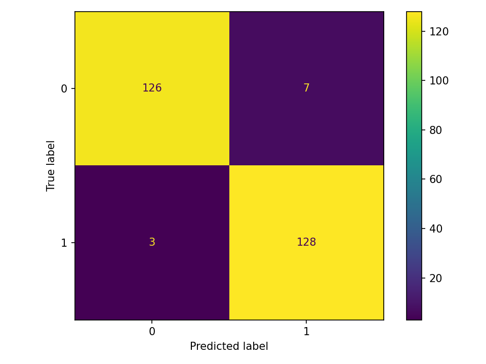
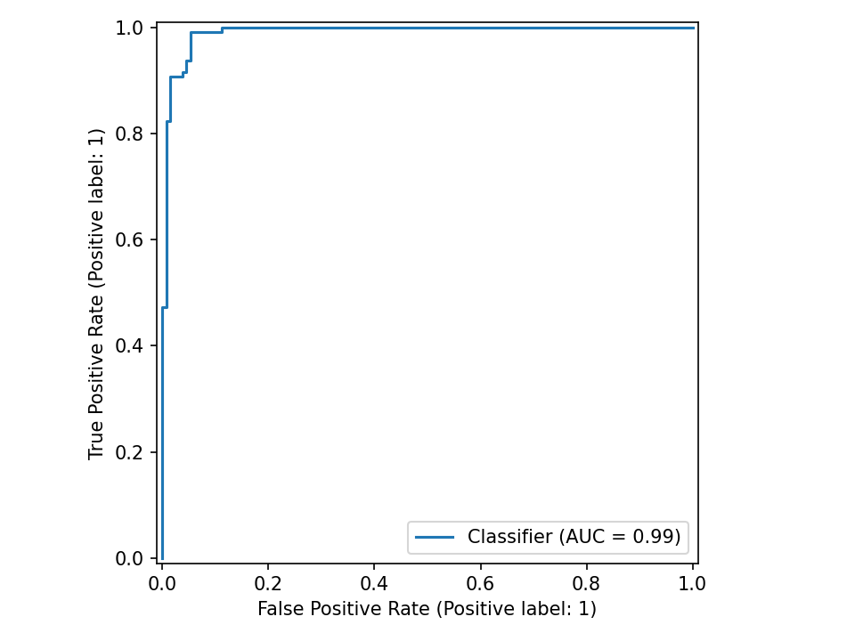
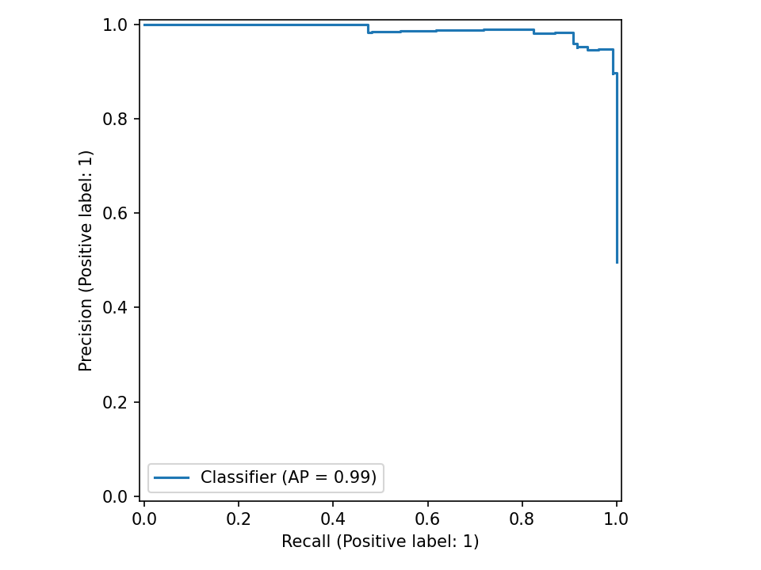

# Clasificación binaria (demo)

**Tarea:** Clasificación

## Métricas
| métrica | valor |
|---|---:|
| accuracy | 0.9621 |
| precision_macro | 0.9624 |
| recall_macro | 0.9622 |
| f1_macro | 0.9621 |
| precision_weighted | 0.9626 |
| recall_weighted | 0.9621 |
| f1_weighted | 0.9621 |
| roc_auc | 0.9911 |

## Gráficos

