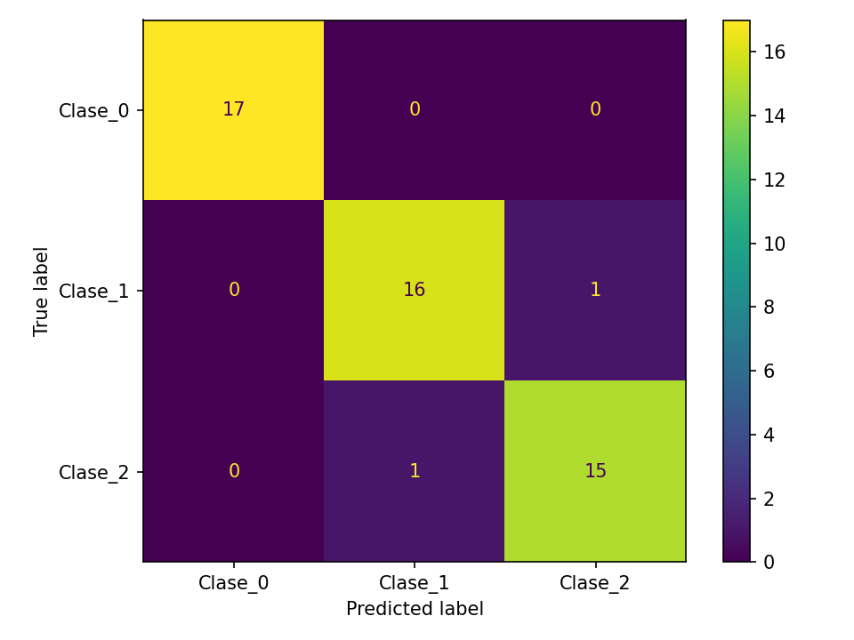
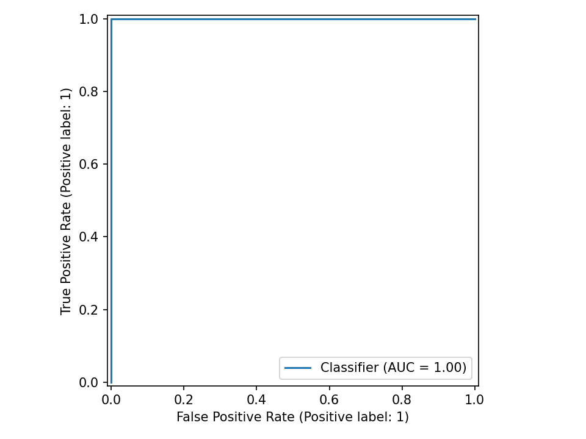
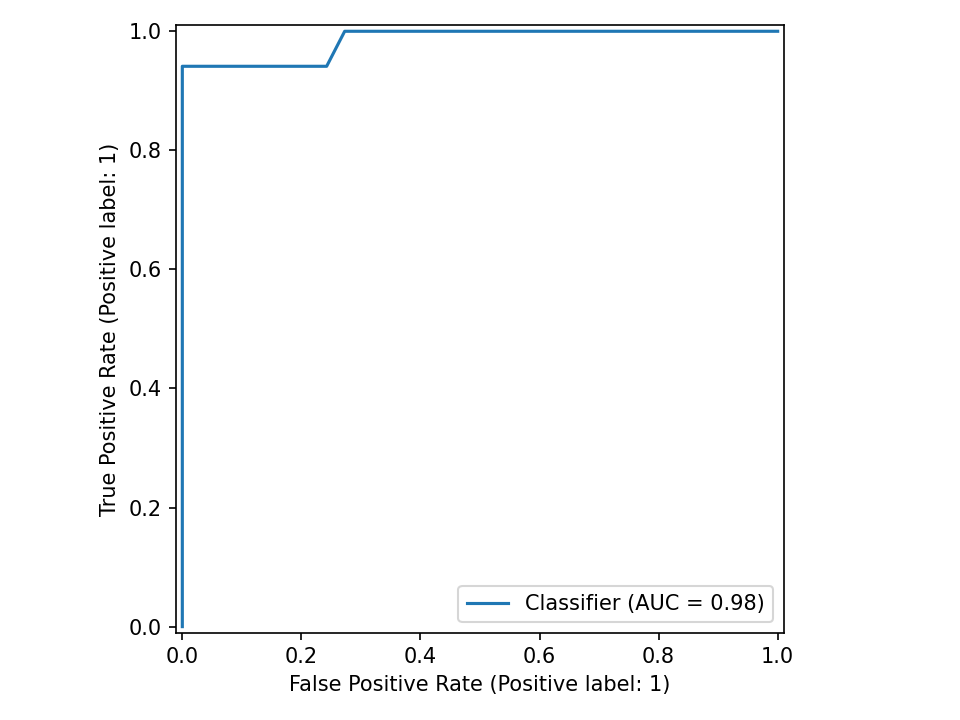
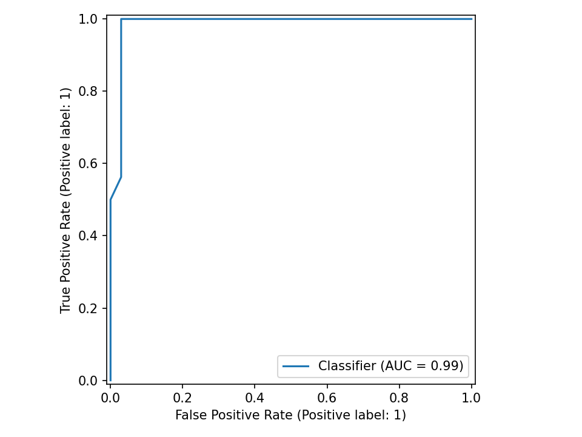
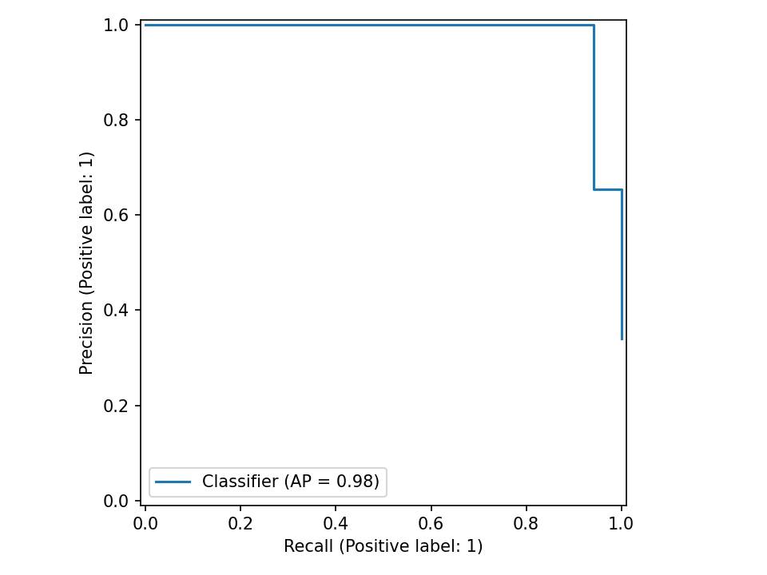
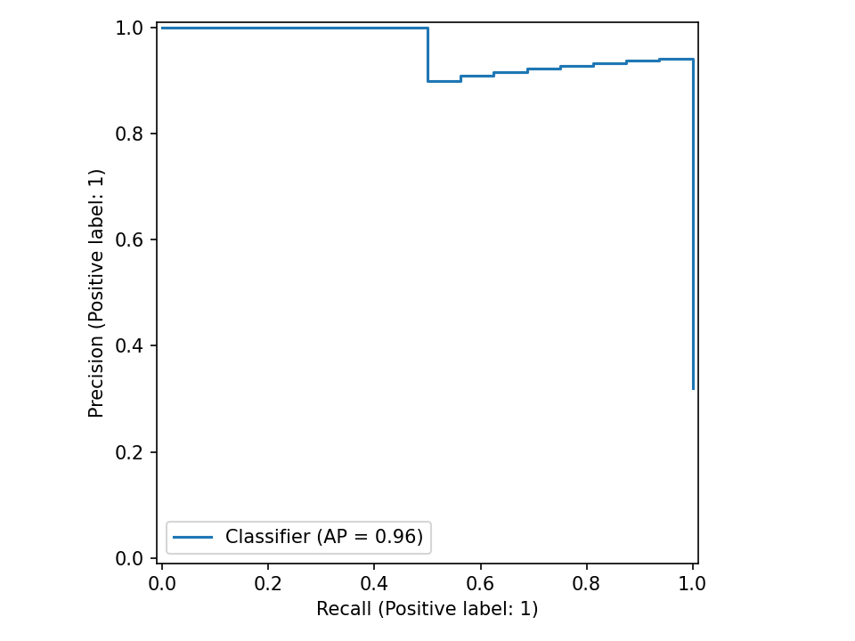

# Clasificación multiclase OvR (demo)

**Tarea:** Clasificación

## Métricas
| métrica | valor |
|---|---:|
| accuracy | 0.9600 |
| precision_macro | 0.9596 |
| recall_macro | 0.9596 |
| f1_macro | 0.9596 |
| precision_weighted | 0.9600 |
| recall_weighted | 0.9600 |
| f1_weighted | 0.9600 |
| roc_auc_ovr_macro | 0.9904 |

## Gráficos

